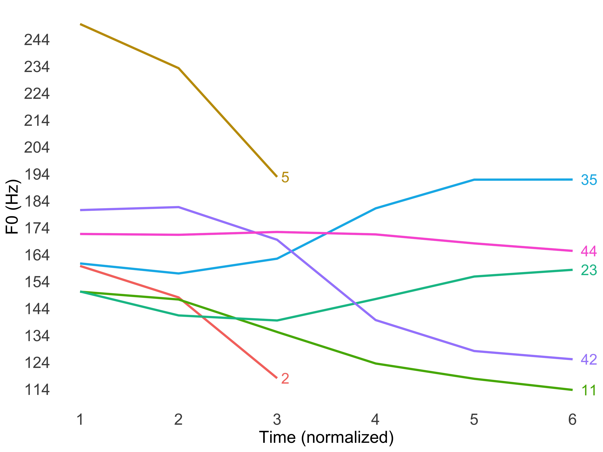

```{r echo=FALSE, message = FALSE}
knitr::opts_chunk$set(echo = FALSE,
                     fig.align = 'center',
                     options(warn=-1))
suppressMessages(library(rmarkdown))
suppressMessages(library(knitr))
```


***

### Fieldwork on Xiapu Min

Xiapu Min is a variety of Min language mainly spoken in the county of Xiapu in southeastern China with approximately 500, 000 speakers. I started the documentation work on Xiapu Min since the summer of 2018. I am currently investigating the tone sandhi system of Xiapumin through measuring the degree of acoustic and articulatory neutralization after tone sandhi. The picture below is a F0 track of the seven tones in Xiapu Min.

<center>

</center>


***

### Voice quality

I am interested in the production of voice quality in general. I studied the effect of F0, utterance position, and sentence type on the production of creak in Mandarin utterances.

***

### Language acquisition

I study how the phonological system of people's native language influences their acquisition of non-native languages. My master thesis discusses how Mandarin speakers discriminate English vowels, and whether their discrimination accuracies can be predicted by the way they assimilate English vowels into Mandarin categories.

