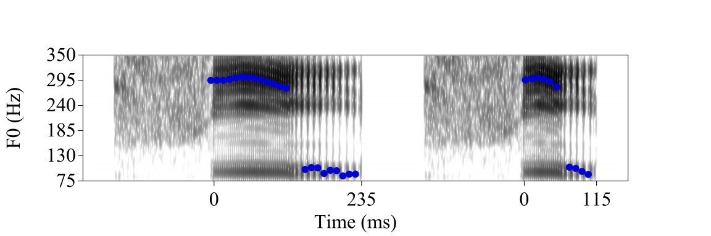

```{r echo=FALSE, message = FALSE}
knitr::opts_chunk$set(echo = FALSE,
                     fig.align = 'center',
                     options(warn=-1))
suppressMessages(library(rmarkdown))
suppressMessages(library(knitr))
```


***
### Fieldwork on San Francisco Yatee Zapotec

San Francisco Yatee Zapotec is spoken in the town of San Francisco Yatee, north of Oaxaca, Mexico. I started the documentation work on Yatee Zapotec in the spring of 2020. I am currently doing fieldwork with two native speakers of Yatee Zapotec. My main goal is to figure out the sound system of Yatee Zapotec while my main focus is on the phonation type, tone, and their interaction in the language.

Yatee Zapotec has three phonation types: modal, checked, and rearticulated phonations. Checked phonation has late-phased glottalization relative to vowels; rearticulated phonation has mid-phased glottalization relative to vowels. The acoustics of the phonation types in Yatee Zapotec as presented as a [poster](file/Chai_Fernandez_Mendez_ASA_S2023.pdf) at the 184th meeting of Acoustic Society of America in Chicago.

A report of the sound inventory of the language has been presented at the [PhonCo group](http://phonco.ucsd.edu/) of the Department of Linguistics at UCSD. [slides](file/phonco_slides_YZ_YC.pdf)

<a href="#top">Back to top</a>

***
### Acoustics of creaky voice

"Creaky voice" refers to a number of different kinds of voice production with similar percepts. Collaborating with Patricia Keating, Marc Garellek, and Jody Kreiman, we study the acoustic properties of different kinds of creaky voice. There are three key properties of creaky voice: low F0, irregular F0, and constricted glottis. Prototypical creaky voice has all three properties. We find that none of the three properties are necessary to create a creaky percept. Low F0 and irregular F0 alone are sufficient to create a creaky percept. The combination of low F0 and irregular F0; and of low F0 and constricted F0 are also sufficient to create a creaky percept.

Our finds were presented as a [poster](file/Keating_et_al_ASA_S2023.pdf) at the 184th meeting of Acoustic Society of America in Chicago.

<a href="#top">Back to top</a>

***
### Checked syllables, vowels, and tones
Checked syllables usually have the characteristics of being short, having glottalization at the end of the syllable, and being associated with specific tones. Such syllables are usually found in Chinese languages and Otomanguean languages. Xiapu Min, the language I do fieldwork on, has such syllables (i.e. Checked tone 5 /θiʔ5/湿 "wet"). However, there has not been consensus on what the acoustic and articulatory features of checked syllables are cross-linguistically. My dissertation topic is "Phonetics of checked syllables and vowels", aiming to investigate how checked syllables and vowels are produced and what acoustic features are important for listeners to identify a checked syllable.

<a href="#top">Back to top</a>

#### Phonetics of checked tones in citation and sandhi forms in Xiapu Min

We measure the F0, H1-H2, HNR, duration, and voice quality of the two checked tones, high-falling-checked Tone 5 and low-falling-checked Tone 2 in Xiapu Min. We compared the phonetic properties of checked tones with their unchecked tone minimal pairs. We found that in citation forms, checked tones are shorter than unchecked ones. Their F0 is different from unchecked tones in the F0 space. Checked tones are realized with glottalized quality in the end, whereas unchecked tones have a modal quality.


In sandhi forms, checked tones are neurtralized with unchecked tones in F0 and voice quality. However, checked tones remain to be shorter than unchecked tones after sandhi.


The manuscript of this study has been submitted to [Languages special issue](https://www.mdpi.com/journal/languages/special_issues/Phonation_Prosody) and currently under review. [manuscript](file/XM_checked_tone_YC_YS.pdf)


* A minimal pair of the seven lexical tones in Xiapu Min
```{r}
minimal_pair = data.frame(Segment = c("/&#x03B8;i44/","/&#x03B8;i42/","/&#x03B8;i35/","/&#x03B8;i23/","/&#x03B8;i11/","/&#x03B8;i&#x0294;5/","/&#x03B8;i&#x0294;2/"),Word = c("&#x8BD7;","&#x6B7B;","&#x56DB;","&#x662F;","&#x65F6;","&#x6E7F;","&#x5B9E;"),Gloss = c("poem","die","four","to be","time","wet","concrete"))

knitr::kable(minimal_pair)

```


<a href="#top">Back to top</a>

#### Perception of checked tones in citation forms in Xiapu Min

The production results show that checked tones in Xiapu Min are characterized by short duration, vowel-final glottalization, and distinct F0. We ask whether listeners make use all three features when identifying a checked tone, and whether they rely on one feature more than the others.


We manipulated those three variables and invited Xiapu Min listeners to participate in a forced-choice identification task. The results show that short duration is the most important cue, followed by creaky voice quality. F0 appears to be least important among the three cues.


The results have been presented as a poster at 181st Annual Meeting of Acoustic Society of America. [poster](file/Chai_ASA_F2021_print.pdf)


* Spectrogram of sample manipuated stimuli (Top-left: F0 of T5, Long, Modal; Top-right: F0 of T5, Short, Modal; Bottom-left: F0 of T5, Long, Creaky; Bottom-right: F0 of T5, Short, Creaky)
<center>



</center>


<a href="#top">Back to top</a>


***

### Voice quality

I am interested in the production of voice quality in general. I have studied the effect of F0, utterance position, and sentence type on the production of creak in Mandarin utterances. The manuscript has been published at the San Diego Linguistic Papers (SDLP) Issue 8. [escholarship link](https://escholarship.org/uc/ucsdling_sdlp8)

<a href="#top">Back to top</a>

***

### Language acquisition

I study how the phonological system of people's native language influences their acquisition of non-native languages. My Master's thesis from CU Boulder discusses how Mandarin speakers discriminate English vowels, and whether their discrimination accuracies can be predicted by the way they assimilate English vowels into Mandarin categories. The revised manuscript has been published at the the San Diego Linguistic Papers (SDLP) Issue 9. [escholarship link](https://escholarship.org/uc/ucsdling_sdlp9)

<a href="#top">Back to top</a>
