```{r setup, include=FALSE}
knitr::opts_chunk$set(echo = TRUE, warning = FALSE, message = FALSE, fig.width = 5, fig.height = 3, fig.align = "center")
library(ggplot2)
library(dplyr)
library(ggforce)
library(ggpubr)
library(scales)
library(reshape2)
library(tidyr)
library(phonR)
```

# Data links

* [Sample data](https://yuanchaiyc.github.io/website/subpages/sample/Hawaiian_data.zip)
* [Slides](https://yuanchaiyc.github.io/website/subpages/Tutorial_VS.pdf)
* R code
    + [online](https://posit.cloud/content/5398051)
    + [offline](https://yuanchaiyc.github.io/website/subpages/VS-tutorial.Rmd)


# What is VoiceSauce

* It is a software for analyzing acoustic parameters of audio files. 
* Specifically, it can analyze voicing source-related parameters, such as the amplitude of harmonics, spectral tilts, noise level (Harmonic-to-noise ratio, Cepstral Peak Prominence, Subharmonic to Harmonic Ratio), Energy, Strength of Excitation (the amplitude of voicing). 
* It has the advantage of comparing between different algorithms. For F0, it contains the measures of STRAIGHT, SNACK, and Praat. For formants, it has SNACK and Praat. You can also develop your own algorithm and manually enter values for specific parameter.
* VoiceSauce output a measure for every 1 millisecond of the audio. You can either output all the values or divide the audio into several equal-timed intervals and output the mean of each interval.

* Citation:
    
    + Y.-L. Shue (2010), The voice source in speech production: Data, analysis and models. UCLA dissertation.
    + Shue, Y.-L., P. Keating , C. Vicenik, K. Yu (2011) VoiceSauce: A program for voice analysis, Proceedings of the ICPhS XVII, 1846-1849.

# To install VoiceSauce

To access the full features of VoiceSauce, please download VoiceSauce.exe (Windows users) or Matlab (Mac users) following the instructions below. If you prefer not downloading softwares to your computer, you can go to Matlab online to access VoiceSauce with features limited to measuring F0, noise level, Energy, Amplitude of voicing.

## Windows users
1. Go to http://www.phonetics.ucla.edu/voicesauce/. Under "Compiled Matlab executables - Windows 7/10", click on Matlab Component Runtime and install the installer.exe<br>
<center>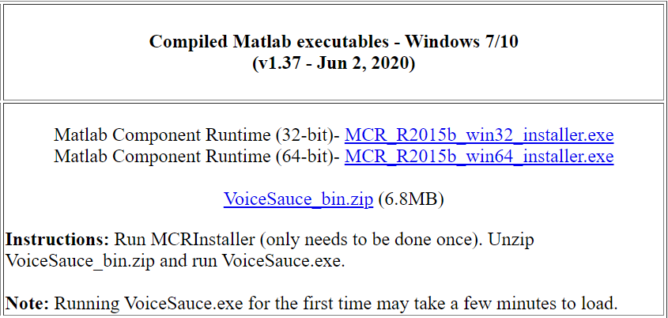{width=50%}</center>
    + To find out whether your computer has 32-bit or 64-bit system, go to "Start" &#8594; "Settings" &#8594; "About". On the main page you will see "System type."<br>
<center>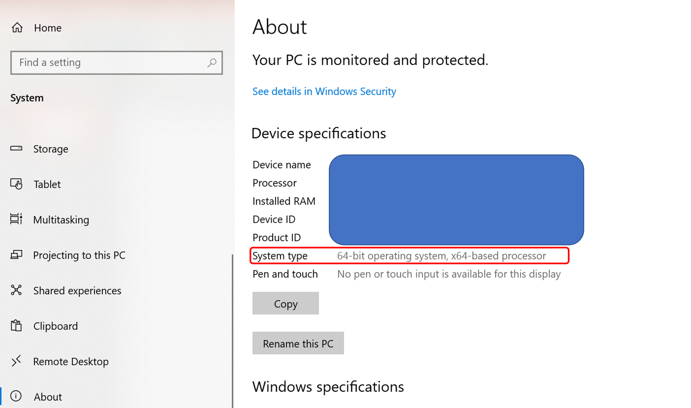{width=50%}</center>
2. Download VoiceSauce_bin.zip, unzip the .zip folder, and click on VoiceSauce.exe to run the program.
<center>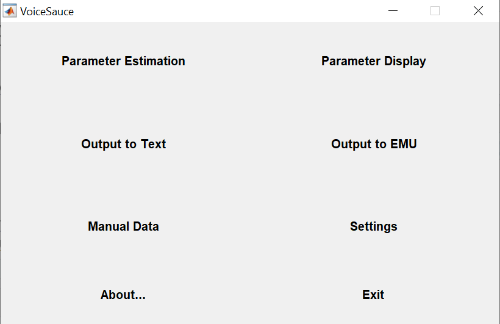{width=40%}</center>

## Mac users

1. Go to http://www.phonetics.ucla.edu/voicesauce/. Under "Matlab m-code", click on "VoiceSauce.zip" to download it. After download, unzip the VoiceSauce into a regular folder.
<center>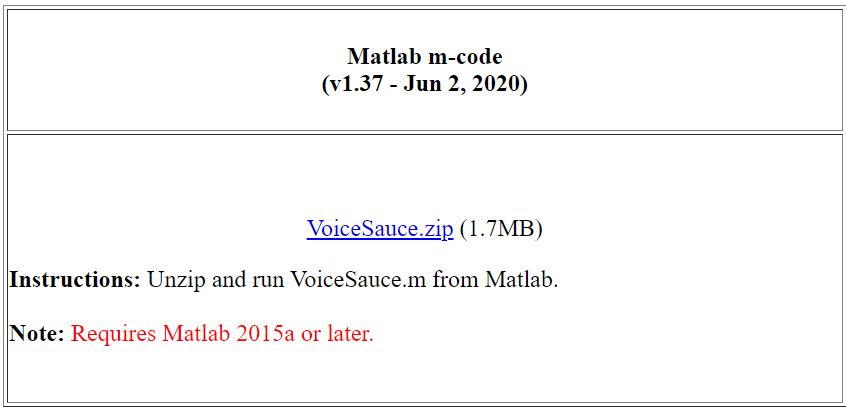{width=50%}</center>
2. Install Matlab so that we can open VoiceSauce in Matlab:
* Go to Matlab support at UHM: [here](https://www.mathworks.com/academia/tah-portal/university-of-hawaii-manoa-40591263.html). Click "Sign in to get started". Log in with your UH username and password.
    + New Users: Create a MathWorks Account. After entering your information, you will be sent an email to verify this account. Log in with your newly created MathWorks Account to download the software.
    + Returning users: Log in with your MathWorks Account information to download the software.
* After logging into your Matlab account, select "Install MATLAB".  Select "R2022b", click on "Download for macOS". Open "matlab_R2022b_maci64.dmg". The installation will start.
* At the step  of "Select products", select "MATLAB" and "Signal Processing Toolbox". Then proceed to the end of "Begin install".
<center>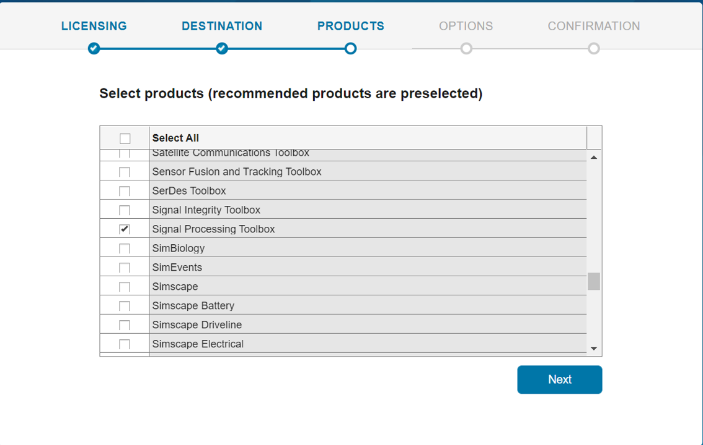{width=50%}</center>
3. Open Matlab. Click on the rightmost icon at the address bar "Browse for folder". Navigate to the location where the VoiceSauce folder was stored. Select the VoiceSauce folder and click "Select folder".
<center>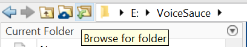{width=30%}</center>
4. On the left, find "Current folder" panel, find "VoiceSauce.m" and double left-click on the file.
<center>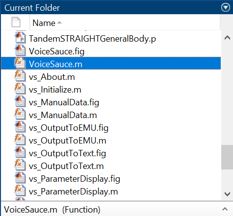{width=30%}</center>
5. The scripts show up in the Editor in the main panel. Under the tab of "EDITOR", click on "Run". The interface of VoiceSauce shows up.
<center>{width=70%}</center>
<center>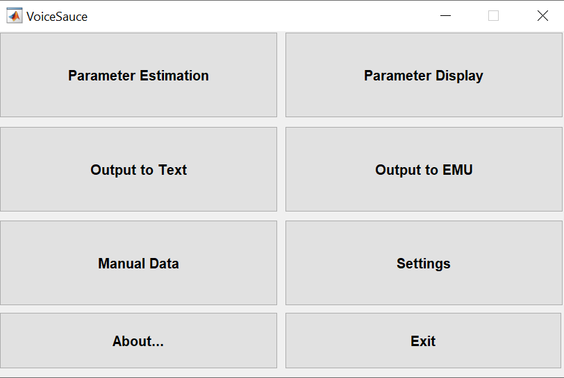{width=40%}</center>

## Online platform

* Note that the online platform cannot compute formants or harmonic amplitudes with formant correction.
1. Go to http://www.phonetics.ucla.edu/voicesauce/. Under "Matlab m-code", click on "VoiceSauce.zip" to download it.
<center>{width=50%}</center>
2. Go to Matlab support at UHM: [here](https://www.mathworks.com/academia/tah-portal/university-of-hawaii-manoa-40591263.html). Click "Sign in to get started". Log in with your UH username and password.
    + New Users: Create a MathWorks Account. After entering your information, you will be sent an email to verify this account. Log in with your newly created MathWorks Account to download the software.
    + Returning users: Log in with your MathWorks Account information to download the software.
3. After logging into your Matlab account, select "Open MATLAB Online". An online portal of Matlab opens.
4. Under "Home" tab, click on "Upload", navigate to the place where VoiceSauce.zip locates. Select VoiceSauce.zip.
<center>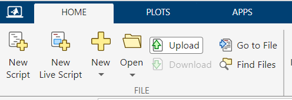{width=40%}</center>
5. Under the left panel "Current Folder", double-click "VoiceSauce.zip" and unzip it. Click on the triangle besides the VoiceSauce folder to unfold it. Find "VoiceSauce.m" in the list and double click on it.
<center>{width=30%}</center>
6. Under the tab "Editor", click on "Run". If a prompt warns you that the script is not found in the path, select "Add to path". The interface of VoiceSauce shows up.
<center>{width=40%}</center>

# How to use VoiceSauce

## Prepare your .wav and .Textgrid files:

* Put your audio file and TextGrid files in the same folder. 
    + The .Textgrid file should have the same name as its corresponding .wav file. Avoid any special characters (e.g. IPA symbols /ʔ, ə, ɯ/, letters with diacritics /ä, ã/). 
    + You can assign a different letter to the special characters and create a code sheet to keep a record of their correspondence. 
    + A sample folder with audio and Textgrid files can be found [here](sample/Indonesian_Stress_Soderberg_Olson_JIPA_2008.zip).

## Settings in VoiceSauce

* Click on "Setting". Under "Common", change "Not a number label" as "NaN".
    + Other parameters that you can adjust:
        - F0: Max/Min F0
        - Formants: Praat Max formant freq; Number of formants;
        - Textgrid: Tier numbers (i.e. if you have multiple tiers in your Textgrid file, which tier you'd like to analyze.)

## Parameter estimation

1. Click on "Parameter Estimation"
2. Under "Input (\*.wav) directory", click "Browse", navigate to the folder where your .wav and .Textgrid files are stored, and click "select folder". You will see a list of the files in that folder in the upper panel of the window.
3. If you'd like to save the output .mat files in the same folder with the sound, check "Save \*.mat files with \*.wav files". If you'd like a different location, navigate to that location under "Output (\*.mat) directory".
4. Click "Parameter Selection" and select the parameters you want to estimate. If you do not have Praat installed, deselect F0 (Praat) and Formants (Praat).
<center>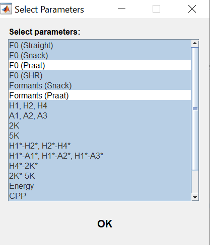{width=40%}</center>
5. Deselect "Process using 16kHz sampling rate" if that is not what you want. Check "Use .Textgrid segmentation information if available".
6. Click "Start!" to start the parameter estimation.
<center>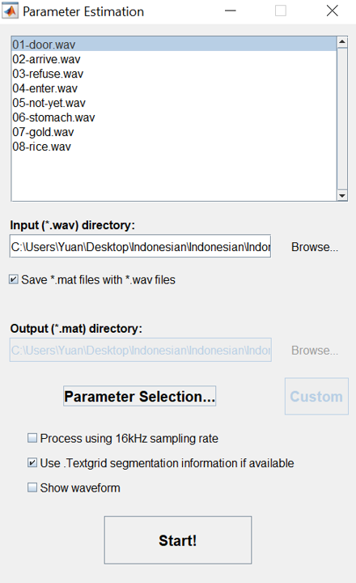{width=40%}</center>
7. After seeing the message "Processing complete", close the window.
<center>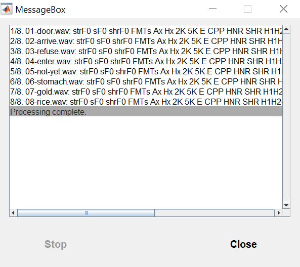{width=40%}</center>

## Output to Text
1. Click "Output to Text"
    + Input .mat directory: where you saved the .mat output
    + Input .Textgrid directory: where you saved the .Textgrid files
    + Include EGG data: if you have EGG data that you want to include, navigate to the place where you saved .egg files
    + Output .txt directory: where you want to save the .txt output
    + Sub-segments:
        - No sub-segments: output all the data that are measured every 1 millisecond
        - Use sub-segments: the number of mean intervals you want to have for each target sound. E.g. if you enter "3", it will divide each target sound into three equal-timed intervals and calculate the mean value of each parameter for each interval.
    + Parameters: select the ones that you want to include in the .txt output
    + Output Options:
        - Single file; You can customize the name of the output file under "Output file"
2. An example output setting where I output H1\*-H2\*, CPP, Energy, HNR05, Formants, SoE and output only the mean for each target sound:
<center>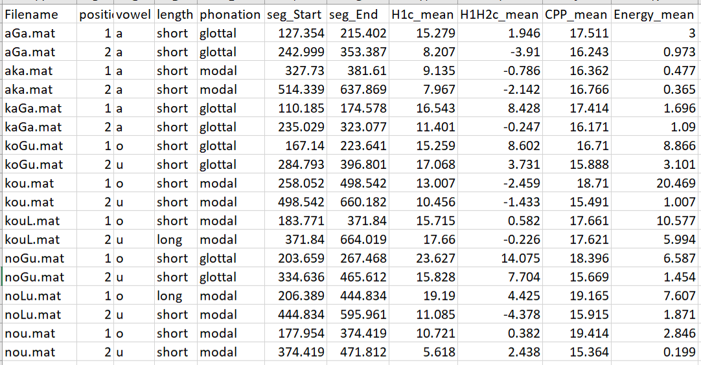{width=40%}</center>
3. After finishing the input, click on "Start!"


# Analyze the output in Excel

## Open the output.txt in Excel
* Go to "Data" tab &#8594; "From Text/CSV" &#8594; Navigate to the location where output.txt is saved and select "output.txt"
* Split the "Label" by go to "Data" tab &#8594; "Delimited" &#8594; Other "-" &#8594; "Next" &#8594; "Finish"

## Create figures
1. Select the column of interest. For example, in the example data file for the acoustic correlates of Indonesian stress, we will select the columns of "phonation" and "HNR05_mean".
2. Go to tab "Insert" &#8594; "Chart" &#8594; "Box & Whisker" &#8594; "OK". The figure is as below:
<center>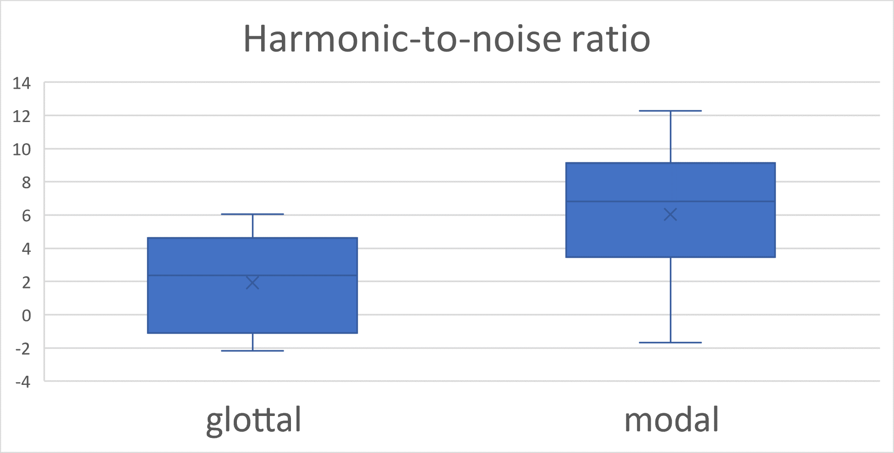{width=50%}</center>

## Create figures in R

### Read the file
```{r}
df = read.csv("sample/Hawaiian_data/output_for_reference/output_mean_selected.txt", header = TRUE, sep = "\t") %>%
    separate(Label, c("position","vowel","length","phonation"), "-")
```

### Create boxplot
```{r}
df$phonation = factor(df$phonation, levels = c("modal","glottal"))

figure.hnr = df %>%
  ggplot(aes(x=phonation,y=HNR05_mean, color = phonation))+
  geom_boxplot()+
  ylab("HNR")+
  theme_bw()

print(figure.hnr)
```

### Create boxplots for different positions in the syllable

```{r}

figure.hnr.byposition = df %>%
  ggplot(aes(x=phonation,y=HNR05_mean, color = phonation))+
  geom_boxplot()+
  ylab("HNR")+
  facet_grid(.~position)+
  theme_bw()

print(figure.hnr.byposition)
```

### Create vowel plot

```{r}
figure.vowelchart=with(df, plotVowels(sF1_mean, sF2_mean, vowel, group = phonation, plot.tokens = FALSE, plot.means = TRUE, pch.means = vowel, cex.means = 2, var.col.by = phonation, poly.line = TRUE, poly.order = c("e", "a", "o", "u"), pretty = TRUE, legend.kwd = "bottomright"))
```

